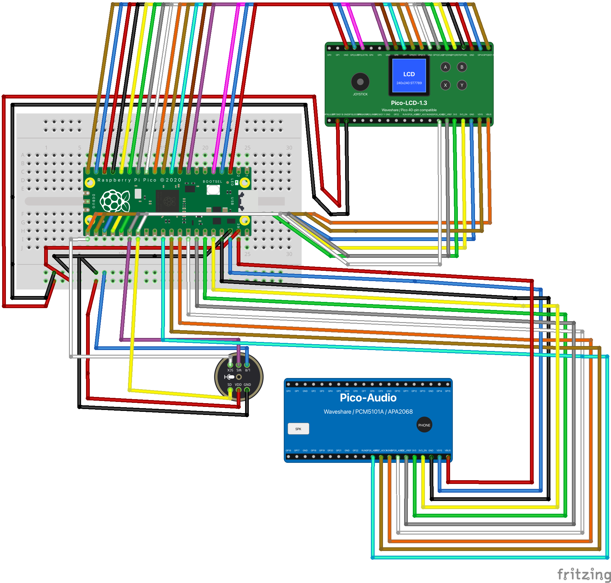

# Pico 2 W リアルタイム Opus 音声ストリーミング PoC

> RP2350 / Pico 2 W 上で I2S MIC + I2S DAC + LCD + CYW43 Wi-Fi を同時に動かし、Opus 圧縮した音声をクラウドへ送受信する低帯域リアルタイム音声端末 PoC。

教育用・低価格 MCU でも、PIO I2S・DMA・dual-core 分離・Opus 圧縮を組み合わせれば、クラウド接続型のリアルタイム音声端末を構成できる ── このファームウェアはそれを実証する。

---

## この PoC が証明すること

| 実証項目 | 詳細 |
|---|---|
| **I2S マイク入力** | PIO で I2S プロトコルを生成し、MCU 上でリアルタイム音声キャプチャ |
| **I2S DAC/スピーカ出力** | PIO + DMA ENDLESS ring で低レイテンシ再生 |
| **LCD ステータス UI** | ST7789 1.3" SPI LCD で状態表示 + 操作 UI |
| **CYW43 Wi-Fi 常時接続** | TLS 常時接続を維持しながら音声処理を並行実行 |
| **HTTPS クラウド POST / ポーリング** | 音声の送信・受信を HTTPS 上で実現 |
| **Opus 圧縮ペイロード** | PCM 直送ではなく Opus 16–24 kHz mono で帯域を大幅削減 |
| **Dual-core 完全分離** | Audio/UI と Network を mutex なしで分離、lock-free SPSC ring で接続 |
| **BLE プロビジョニング** | iOS アプリからゼロタッチで Wi-Fi 設定を書き込み |

**要するに:** RP2350 クラス（$7）の MCU 1 台で、Opus / TLS / Wi-Fi / I2S Audio が同時に回り、スマホも PC も不要でクラウド音声端末が成立する。

---

## なぜ Pico 2 W で難しいか

- **RAM 520 KB** — TLS バッファ、Opus デコーダ、オーディオ ring、Wi-Fi スタックが全て同居する
- **Wi-Fi と Audio の同時処理** — cyw43_arch_poll と I2S DMA を止めずに回し続ける必要がある
- **I2S を PIO で実装** — RP2350 には I2S ペリフェラルがないため PIO プログラムで生成
- **Opus デコード** — SILK fixed-point デコーダの VLA が ~3 KB のスタックを消費し、デフォルト 4 KB では溢れる
- **バックプレッシャー制御** — クラウド → TCP → ring buffer → DMA を跨ぐフロー制御を自前で構成


## システム構成

<div style="text-align:center; width:80%; box-sizing:border-box;">
    
</div>

3 ゾーンに分離される。

**Cloud (minimum)** — デバイス登録・WSS トンネル中継・Opus 音声の下り relay のみ。GPU も CDN キャッシュも持たない。

**Publisher (maximum)** — radio / MIC / music などの custom service を動的に登録。音声ミキシングとエンコードは Publisher 側で完結し、Cloud はパケットを通過させるだけ。

**MCU + Speaker** — RP2350 + CYW43 が Wi-Fi 経由で Cloud に TLS 常時接続し、Tunnel 経由で下りてきた Opus パケットを on-chip デコード → I2S DAC で再生する。


## Core 分離アーキテクチャ

<div style="text-align:center; width:80%; box-sizing:border-box;">
    
</div>

RP2350 の 2 コアを完全に分離し、mutex なしで音声パイプラインを構成する。

| | Core 0 (20 KB stack) | Core 1 (4 KB stack) |
|---|---|---|
| **役割** | Audio / UI / Opus Encode & Decode | Network / Transport / Forwarding |
| **Stack 配置** | Main RAM top + SCRATCH_X (併合) | SCRATCH_Y |
| **重い処理** | opus_encode (SILK VLA peak 18.9 KB) | TLS handshake / cyw43_arch_poll |
| **Loop cadence** | 1 ms | 500 μs |
| **IC 方向** | Consumer (audio data) | Producer (opus pkt / PCM chunk) |

Core 間通信は **64 KB の SPSC ring buffer + HW FIFO notify (8 slot)**。バックプレッシャーは audio ring 充填率 75% → IC dequeue 停止 → IC ring 充填 → ic_send_avail==0 → forward_pump skip → g_https_resp 充填 → recv_cb ERR_MEM → TCP window close まで自動カスケードする。

<div style="page-break-before: always;"></div>

## 音声パイプライン

上りと下りは **独立した DMA ring を持ち、サイズ・方向・バッファリング戦略が非対称** である。

<div style="text-align:center; width:80%; box-sizing:border-box;">
    
</div>

下りはリアルタイム連続再生のため大きな DMA ring (32 KB) で揺らぎを吸収し、上りは発話単位のバッチ送信のため ring は最小限 (4 KB) にして encoder + accumulator 側でバッファリングする。用途が違うので対称にする理由がない。

---

## RP2350 で Opus + TLS + Wi-Fi を同時成立させるための SRAM 配分診断

<div style="text-align:center; width:80%; box-sizing:border-box;">
    
</div>

RP2350 は Main RAM (512 KB) とは別に **SCRATCH_X / SCRATCH_Y** という 4 KB × 2 の専用 SRAM バンクを持つ。SDK デフォルトでは Core 0 が SCRATCH_Y、Core 1 が SCRATCH_X をスタックに使い、バス競合なしに各コアが独立アクセスできる。

しかし Opus (SILK fixed-point) のエンコーダは内部で **VLA (Variable Length Array)** を多用し、これはヒープではなくスタック上に確保される。関数呼び出し中にスタックが一気に膨らみ、実測で `opus_encode` が **18,912 B** をピーク消費する（デコード側は 4,864 B）。デフォルトの 4 KB では到底足りない。

そこで SDK デフォルトのリンカスクリプト (`memmap_default.ld`) を置き換える**カスタムリンカスクリプト `memmap_bigstack.ld`** を作成し、以下の再配置を行った:

- `.stack_dummy` を SCRATCH_Y → **RAM** セクションへ移動（Core 0 スタックを Main RAM top に配置）
- `.stack1_dummy` を SCRATCH_X → **SCRATCH_Y** へ移動（Core 1 スタックの退避先）
- `__StackTop` を `ORIGIN(SCRATCH_X) + LENGTH(SCRATCH_X)` = 0x20081000 に設定（SCRATCH_X 併合）
- `__HeapLimit = __StackBottom` を明示的に定義（ヒープ上限をスタック底に一致させる）

これにより Core 0 のスタックは **Main RAM top (0x2007c000) 〜 SCRATCH_X 末尾 (0x20081000) の 20 KB** に拡張される。Main RAM と SCRATCH_X は物理的に隣接しているため連続領域として併合でき、SCRATCH_X 分の 4 KB はヒープを削らずにスタック容量へ加算できる。Core 1 は SCRATCH_X を明け渡し **SCRATCH_Y (4 KB)** に移動 — Core 1 は Opus を実行せず、cyw43 / lwIP / mbedTLS のコールチェーン自体は浅い（重いバッファ確保は Main RAM の共有ヒープから malloc されるため）ので、スタック 4 KB で足りる。

### SRAM 配分を決めた 3 つの計測手段

MMU もスタックガードページもない MCU では、スタックオーバーフローはヒープやリターンアドレスを無言で破壊する — ハングや見当違いのクラッシュとして現れ、原因特定が極めて困難。RP2350 にはメモリ範囲のハードウェアウォッチポイントもないため、以下の 3 つのプローブを組み合わせて SRAM 配分を収束させた。

#### A. `opus_encoder_get_size` / `opus_decoder_get_size` — Opus state の静的サイズ把握

`opus_encoder_get_size(1)` / `opus_decoder_get_size(1)` を init 時に出力し、Opus encoder/decoder state に必要な連続メモリサイズを静的に把握する。`opus_encoder_create()` / `opus_decoder_create()` を使う場合、この state は内部で `malloc` されるため**ヒープ側の固定コスト**になる（一方、`opus_encoder_init()` / `opus_decoder_init()` を使えば static 領域や自前 arena に配置することもできる）。本ファームウェアは `create` を使用しているため、エンコーダ 1 個あたり ~11 KB がヒープから消える — スタックを広げる前に、ヒープにこれだけの余力があるかをまず確認する必要がある。

#### B. `sbrk(0)` による heap break 監視 — TLS / Wi-Fi / malloc 系の余力確認

`stackdiag_heap_report()` が `sbrk(0)` で現在のヒープブレークを読み、`__StackBottom`（= `__HeapLimit`）までの残り容量を報告する。**スタックを広げすぎると逆にヒープが壊れる**という逆方向の障害モードを検出するためのプローブ。

このカスタムリンカスクリプト (`memmap_bigstack.ld`) では `__HeapLimit = __StackBottom` と意図的に定義しており、Core 0 スタックのうち Main RAM 側に食い込む部分はヒープと 1:1 で食い合う（ただし SCRATCH_X を併合した 4 KB 分はヒープを削らずにスタック容量へ加算できる）。`PICO_STACK_SIZE` を上げれば `__StackBottom` が下がりヒープ上限が縮小する。mbedTLS の `altcp_tls_new` だけで ~16 KB のレコードバッファを `malloc` するため、ここが詰まると Wi-Fi が無言で死ぬ。実際に `0x6000` (24 KB) にした時、このプローブがブレークと上限の差が 8 KB 未満であることを示し、OOM の原因を特定できた。

なお `PICO_MALLOC_PANIC`（SDK デフォルト ON）は `malloc` が NULL を返した時に panic するが、`sbrk(0)` は読み取りだけなので **プローブ自体が OOM クラッシュを起こさない**点が重要。

#### C. canary-paint high-water scan — VLA / call stack 実行時ピークの実測

ファームウェアに組み込んだ canary-paint 方式のハイウォーターマーク計測（`main.c`）:

1. **Paint** — ブート直後、スタックが浅いうちに `stackdiag_paint()` がスタック領域全体（+ `__StackBottom` 以下 16 KB のヒープギャップ）をカナリアワード (`0xC5C5C5C5`) で塗りつぶす。現在の SP 直下 256 B はガードとして残す。

2. **Scan** — メインループ内で 2 秒ごとに `stackdiag_hiwater()` が floor から上方スキャンし、最初の非カナリアワードを検出。`__StackTop` からの距離がそれまでのピーク使用量 — `opus_encode` と `opus_decode` 両方のピークを通算で捕捉する。

3. **Overflow 検出** — ハイウォーターマークがスタック領域サイズを超えた場合、溢れ量（"spill"）と最深部 8 ワードの hex dump を出力。Flash リターンアドレス (`0x10xxxxxx`) か RAM ポインタ (`0x20xxxxxx`) かサンプル値かで、破壊元がコールチェーンか DMA の暴走かを判別できる。

このプローブが `opus_encode` のピーク **18,912 B** を実測した。

#### 結論: 3 つのプローブが導いた 20 KB

| プローブ | 計測対象 | 得られた値 |
|---|---|---|
| A. `opus_*_get_size` | ヒープ固定コスト | encoder ~11 KB, decoder ~8 KB |
| B. `sbrk(0)` | ヒープ残余力 | net-ready 時点でブレーク〜上限 ≒ 8 KB 余裕 |
| C. canary-paint | スタック実行時ピーク | `opus_encode` 18,912 B / `opus_decode` 4,864 B |

- C により、スタックは最低 18,912 B + α が必要
- B により、`__StackBottom` をこれ以上下げるとヒープが TLS を賄えない
- A により、ヒープ側の固定コストは既に織り込み済み

→ SCRATCH_X を併合して **ヒープを削らずに 20 KB を確保**する現レイアウトが、3 つの制約を同時に満たす唯一の解として収束した。

### 安定化までの道のり — 何が壊れたか

MMU もスタックガードページもない MCU では、スタックオーバーフローは segfault しない — 隣接メモリを無言で破壊する。症状は「スタックオーバーフロー」ではなく、「音が出ない」「Wi-Fi が繋がらない」「デバイスがハングした」として現れる。最終的な 20 KB レイアウトに至るまでの各ステップは、原因と症状が遠く離れた暗闘だった。

**Phase 1 — SCRATCH_Y 4 KB (SDK デフォルト)**

初期ファームウェアは Core 0 上で SDK デフォルトの SCRATCH_Y 4 KB スタックのまま `opus_decode` を実行。SILK の VLA が ~3 KB、当時スタック上にあった `pcm[480]` (960 B)、コールチェーンのオーバーヘッドで合計が 4 KB を超え、無言でオーバーフロー。`handle_core0_notify` ディスパッチャのリターンアドレスが破壊され、関数から戻れなくなり IC FIFO が永久にウェッジ。Core 1 の `forward_pump` は毎回 `ic_send_avail == 0` に当たり音声の転送を停止。唯一の目に見える症状: **音声が無音のまま** — エラーなし、クラッシュなし、ログなし。

原因特定には canary-paint 計測の追加が必要で、スタックが 4,096/4,096 B に張り付いていることが判明 — 明らかにオーバーフローしているが、どこまで溢れているかは見えなかった。

**Phase 2 — Main RAM 16 KB (`PICO_STACK_SIZE=0x4000`)**

カスタムリンカスクリプト `memmap_bigstack.ld` で Core 0 のスタックを Main RAM top に移設し 16 KB を確保。`pcm[]` も `static` に移動してスタックから 960 B を除去。`opus_decode` は安定 — canary はピーク ~4,864 B を示し、16 KB に十分収まった。

その後 push-to-talk マイクキャプチャを追加し、`opus_encode` が Core 0 に乗った。canary は即座に 16,384/16,384 に張り付き — エンコードのピークが領域を超えた。しかし canary は領域内しか計測できないため、真の深度は不明だった。

**Phase 3 — Main RAM 24 KB (`PICO_STACK_SIZE=0x6000`): Wi-Fi が死んだ**

スタックを 24 KB に拡大すればオーバーフローは解決するはず。実際に解決した — が、`__StackBottom` が 8 KB 下がったことでヒープが同量縮小。mbedTLS の `altcp_tls_new` は `malloc` で ~16 KB のレコードバッファを確保するが、ヒープ上限が下がったため TLS ハンドシェイクが OOM し、Wi-Fi が無言で接続不能に。

`stackdiag_heap_report` プローブにより、net-ready 時点でヒープブレークが `__HeapLimit` まで 8 KB 以内に達していることが確認され — 渡す余地がないことが判明した。

**Phase 4 — Main RAM 16 KB + SCRATCH_X 併合 = 20 KB (`PICO_STACK_SIZE=0x5000`)**

着眼点: Main RAM top (0x20080000) と SCRATCH_X (0x20080000–0x20081000) は物理的に隣接している。Core 1 のスタックを SCRATCH_X → SCRATCH_Y に移し、SCRATCH_X を Core 0 スタックの上位 4 KB として併合すれば、`__StackBottom` を一切下げずに 20 KB (0x207c000–0x20081000) が得られる — **ヒープコストゼロ**。

拡張プローブウィンドウ (`__StackBottom` 以下 16 KB) 付きの canary スキャンで真のピークが判明: `opus_encode` で **18,912 B**。20 KB なら ~1.5 KB の余裕。ヒープレポートもブレークが上限を十分下回っていることを確認。Wi-Fi と TLS は安定を維持した。

**その他、道中で遭遇したメモリサイジングの罠:**

| 何が | 症状 | 根本原因 | 修正 |
|---|---|---|---|
| IC ring 64 KB × 2 | cJSON が 70 KB lab list で OOM | 128 KB BSS でヒープ枯渇 | 32 KB × 2 に縮小 |
| `g_https_resp` 128 KB | `altcp_tls_new` OOM | +188 KB BSS でヒープ上限超過 | BSS 予算内に収めるよう調整 |
| `pcm[480]` on stack | 無音ハング | 960 B + VLA で SCRATCH_Y 超過 | `static` に移動 |
| `opus_encoder_create` | ヒープ圧迫 | エンコーダ 1 個あたり ~11 KB ヒープ | 許容; `sbrk(0)` プローブで検証 |

共通パターン: 520 KB の MCU では **スタック・ヒープ・BSS はゼロサムゲーム**。ひとつのオーバーフローを直すと別が溢れる — 3 つを同時に計測しない限り、暗闇での手探りになる。canary-paint + ヒープブレーク + BSS サイズの 3 点同時プローブは「あると便利」ではなく、制約空間を見通す唯一の手段だった。

---

## 帯域削減効果

PCM 直送と Opus 圧縮の比較:

| | PCM 16 kHz 16-bit mono | Opus 16 kbps |
|---|---|---|
| **ビットレート** | 256 kbps | 16 kbps |
| **削減率** | — | **93.75%** |
| **1 分あたり** | 1.92 MB | 120 KB |

CYW43 の Wi-Fi スループットと RP2350 の処理余力を考えると、Opus 圧縮は「あれば嬉しい」ではなく、**常時接続を安定させるために必須**の設計判断。

---

## Technical Stack

| Layer | What | Why |
|---|---|---|
| MCU | RP2350 dual-core 200 MHz | $7 クラス、Opus リアルタイムデコード可能 |
| Wi-Fi | CYW43 (Pico 2 W) | 常時 TLS 接続 |
| TLS | mbedTLS | HTTPS / WSS |
| Codec (decode) | Opus (SILK fixed-point) 24 kHz mono | Cloud → MCU ストリーミング再生 |
| Codec (encode) | Opus (SILK fixed-point) 16 kHz mono 16 kbps | MCU → Cloud push-to-talk 送信 |
| Audio Out | PIO I2S → PCM5101A DAC | DMA ring 32 KB, ENDLESS mode |
| Audio In | PIO I2S RX ← INMP441 MEMS mic | DMA ring 8 KB, Core 0 で Opus エンコード |
| IC Bus | SPSC ring + HW FIFO | lock-free, zero-copy |
| Provisioning | BLE (BTstack) | iOS app でゼロタッチ設定 |
| Display | ST7789 1.3" LCD | 状態表示 + 操作 UI |

---

## 配線図

<div style="text-align:center; width:80%; box-sizing:border-box;">
    
</div>

---

## ビルド

### 前提

- [Pico SDK](https://github.com/raspberrypi/pico-sdk) (≥ 1.3.0)
- ARM GCC toolchain (`arm-none-eabi-gcc`)
- CMake ≥ 3.12

### ビルド手順

```bash
cd cmake.rp2350
mkdir -p build && cd build
cmake ..
make -j$(nproc)
```

---

## 依存ライブラリ

- [libopus](https://opus-codec.org/) — Opus audio decoding（SILK fixed-point）
- [cJSON](https://github.com/DaveGamble/cJSON) — JSON parsing
