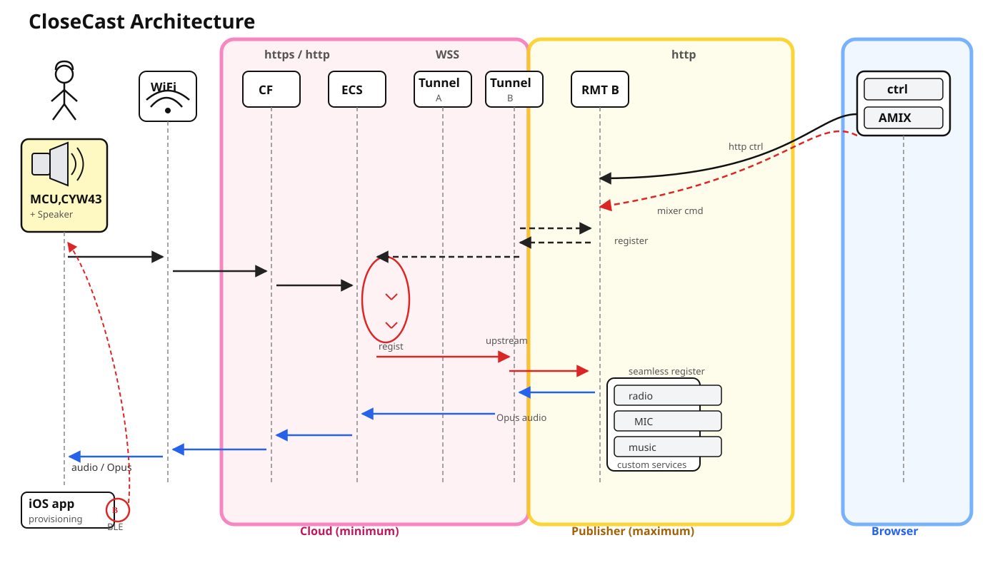
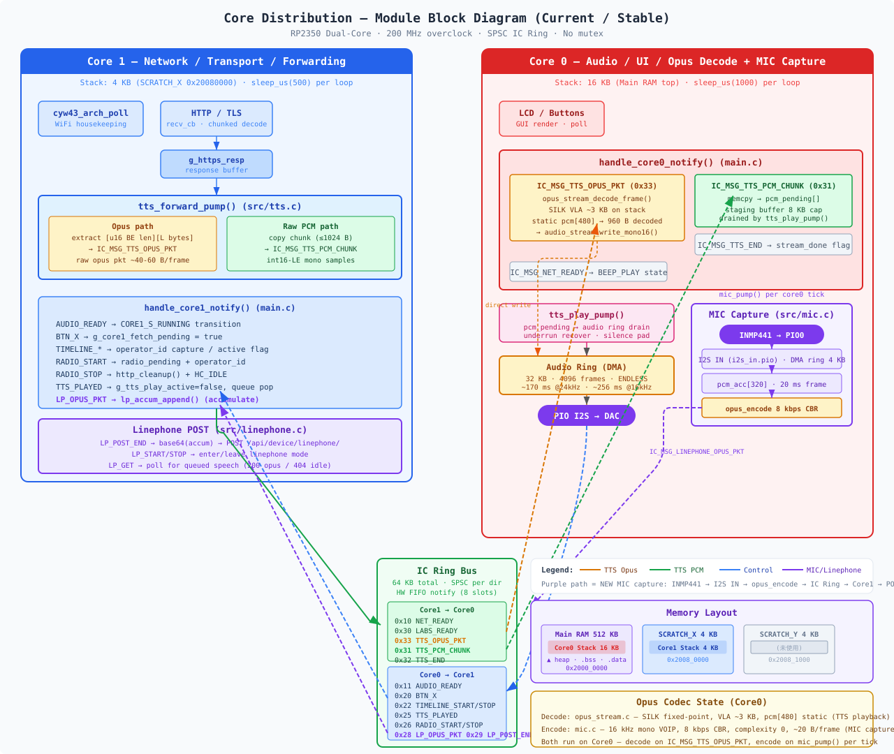
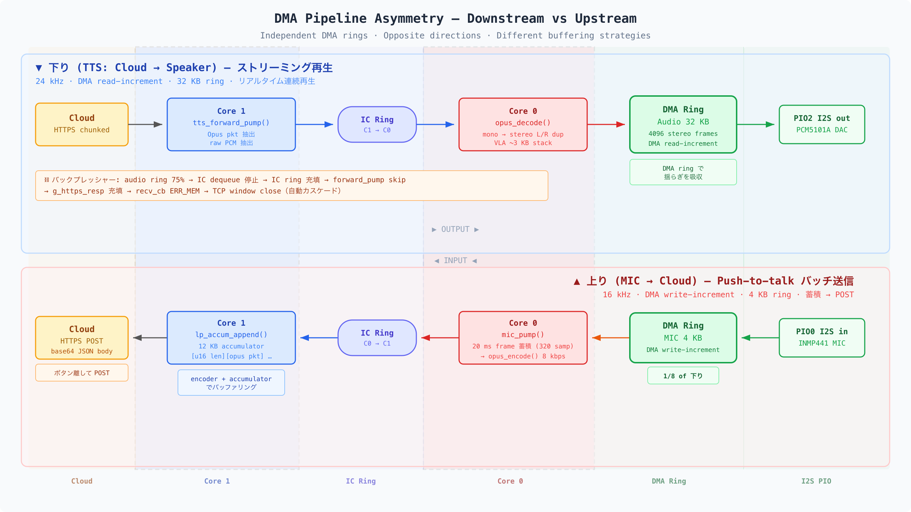
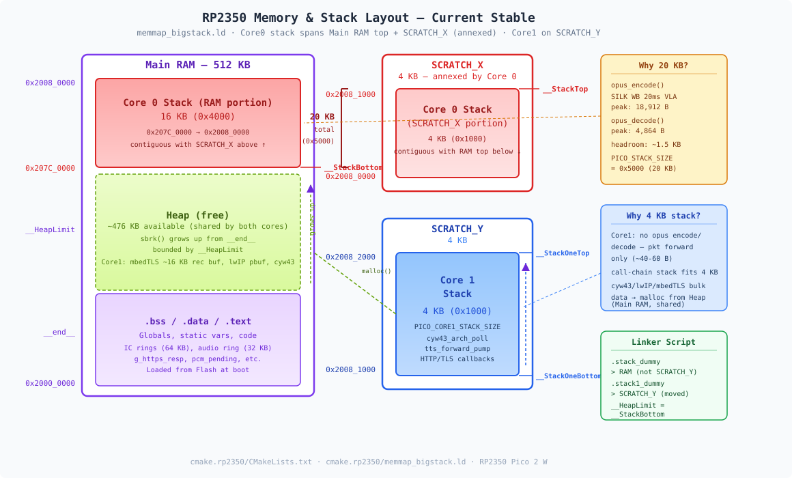

# Pico 2 W Realtime Opus Audio Streaming PoC

> Running I2S MIC + I2S DAC + LCD + CYW43 Wi-Fi simultaneously on RP2350 / Pico 2 W,
> streaming Opus-compressed audio to and from the cloud as a low-bandwidth realtime voice endpoint PoC.

Even on an educational, low-cost MCU, combining PIO I2S, DMA, dual-core separation, and Opus compression makes it possible to build a cloud-connected realtime audio endpoint — this firmware proves it.

---

## What this PoC proves

| Demonstrated | Detail |
|---|---|
| **I2S microphone input** | PIO-generated I2S protocol for realtime audio capture on-MCU |
| **I2S DAC/speaker output** | PIO + DMA ENDLESS ring for low-latency playback |
| **LCD status UI** | ST7789 1.3" SPI LCD for status display and controls |
| **CYW43 Wi-Fi always-on** | Maintaining TLS connection while running audio processing in parallel |
| **HTTPS cloud POST / polling** | Audio send and receive over HTTPS |
| **Opus compressed payloads** | 16–24 kHz mono Opus instead of raw PCM for drastic bandwidth reduction |
| **Dual-core full separation** | Audio/UI and Network separated without mutex, connected via lock-free SPSC ring |
| **BLE provisioning** | Zero-touch Wi-Fi setup from an iOS app |

**In short:** A single RP2350-class ($7) MCU runs Opus / TLS / Wi-Fi / I2S Audio concurrently — a cloud voice endpoint without a smartphone or PC.

---

## Why Pico 2 W makes this hard

- **520 KB RAM** — TLS buffers, Opus decoder, audio ring, and Wi-Fi stack all coexist
- **Concurrent Wi-Fi and Audio** — cyw43_arch_poll and I2S DMA must keep running without stalling
- **I2S via PIO** — RP2350 has no I2S peripheral; PIO programs generate the protocol
- **Opus decoding** — SILK fixed-point decoder's VLA consumes ~3 KB of stack, overflowing the default 4 KB
- **Back-pressure control** — Flow control spanning cloud → TCP → ring buffer → DMA, built from scratch


## System Topology

<div style="text-align:center; width:80%; box-sizing:border-box;">
    
</div>

Three zones, fully separated.

**Cloud (minimum)** — Device registration, WSS tunnel relay, and downstream Opus audio relay only. No GPU, no CDN cache.

**Publisher (maximum)** — Dynamically registers custom services such as radio / MIC / music. Mixing and encoding happen entirely on the Publisher side; the cloud just passes packets through.

**MCU + Speaker** — RP2350 + CYW43 maintains a persistent TLS connection to the cloud over Wi-Fi, decoding Opus packets on-chip via the tunnel and playing them through the I2S DAC.


## Dual-Core Architecture

<div style="text-align:center; width:80%; box-sizing:border-box;">
    
</div>

The two RP2350 cores are fully separated, forming the audio pipeline without any mutex.

| | Core 0 (16 KB stack) | Core 1 (4 KB stack) |
|---|---|---|
| **Role** | Audio / UI / Opus Decode | Network / Transport / Forwarding |
| **Stack location** | Main RAM top | SCRATCH_X |
| **Heavy work** | opus_decode (SILK VLA ~3 KB) | TLS handshake / cyw43_arch_poll |
| **Loop cadence** | 1 ms | 500 μs |
| **IC direction** | Consumer (audio data) | Producer (opus pkt / PCM chunk) |

Inter-core communication uses a **64 KB SPSC ring buffer + HW FIFO notify (8 slots)**. Back-pressure cascades automatically: audio ring fill 75% → IC dequeue stop → IC ring fill → ic_send_avail==0 → forward_pump skip → g_https_resp fill → recv_cb ERR_MEM → TCP window close.

<div style="page-break-before: always;"></div>

## Audio Pipeline

Upstream and downstream have **independent DMA rings with asymmetric size, direction, and buffering strategy**.

<div style="text-align:center; width:80%; box-sizing:border-box;">
    
</div>

Downstream uses a large DMA ring (32 KB) to absorb jitter for realtime continuous playback. Upstream keeps the ring minimal (4 KB) and buffers on the encoder + accumulator side for per-utterance batch transmission. Different purposes — no reason to make them symmetric.

---

## Memory Layout

<div style="text-align:center; width:80%; box-sizing:border-box;">
    
</div>

Core 0's stack is relocated from the SDK default SCRATCH_Y (4 KB) to **16 KB at the top of Main RAM**. The libopus SILK WB 20 ms fixed-point decoder consumes ~3 KB via VLA, overflowing SCRATCH_Y. The heap ceiling is set by `__StackBottom`. Core 1 stays on SCRATCH_X 4 KB since it does not run Opus decoding.

---

## Bandwidth Reduction

Comparing raw PCM vs Opus compression:

| | PCM 16 kHz 16-bit mono | Opus 16 kbps |
|---|---|---|
| **Bitrate** | 256 kbps | 16 kbps |
| **Reduction** | — | **93.75%** |
| **Per minute** | 1.92 MB | 120 KB |

Given CYW43's Wi-Fi throughput and RP2350's processing headroom, Opus compression is not a nice-to-have — it is **essential for stable always-on connectivity**.

---

## Technical Stack

| Layer | What | Why |
|---|---|---|
| MCU | RP2350 dual-core 200 MHz | $7 class, realtime Opus decoding capable |
| Wi-Fi | CYW43 (Pico 2 W) | Always-on TLS |
| TLS | mbedTLS | HTTPS / WSS |
| Codec | Opus (SILK fixed-point) | Low-bandwidth high-quality, 16–24 kHz mono |
| Audio Out | PIO I2S → PCM5101A DAC | DMA ring 32 KB, ENDLESS mode |
| Audio In | PIO I2S MIC | Push-to-talk voice capture |
| IC Bus | SPSC ring + HW FIFO | lock-free, zero-copy |
| Provisioning | BLE (BTstack) | Zero-touch setup via iOS app |
| Display | ST7789 1.3" LCD | Status display + control UI |

---

## Building

### Prerequisites

- [Pico SDK](https://github.com/raspberrypi/pico-sdk) (≥ 1.3.0)
- ARM GCC toolchain (`arm-none-eabi-gcc`)
- CMake ≥ 3.12

### Build

```bash
cd cmake.rp2350
mkdir -p build && cd build
cmake ..
make -j$(nproc)
```

---

## Dependencies

- [libopus](https://opus-codec.org/) — Opus audio decoding (SILK fixed-point)
- [cJSON](https://github.com/DaveGamble/cJSON) — JSON parsing
