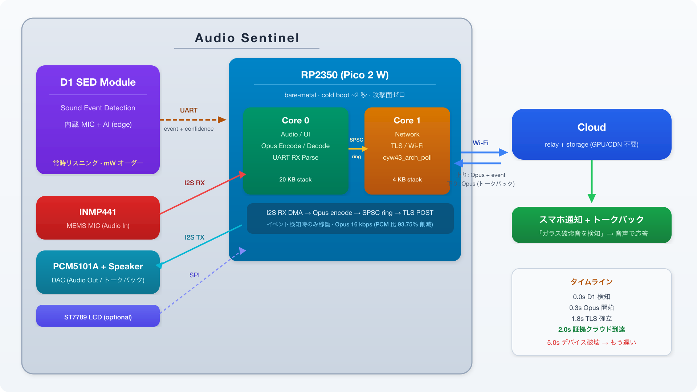
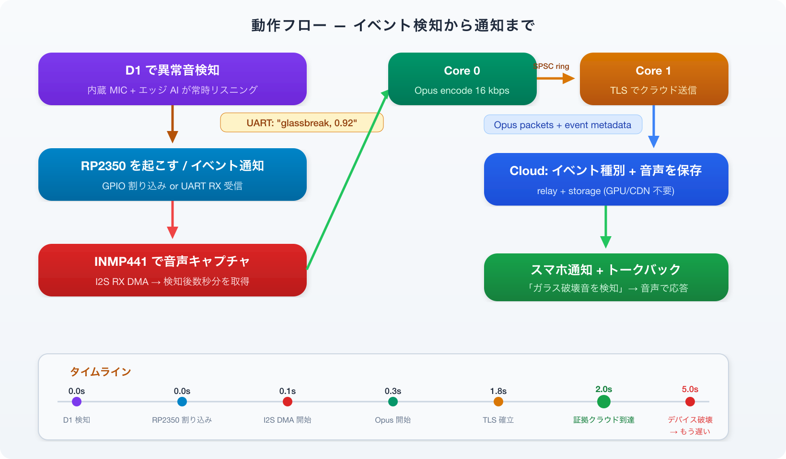
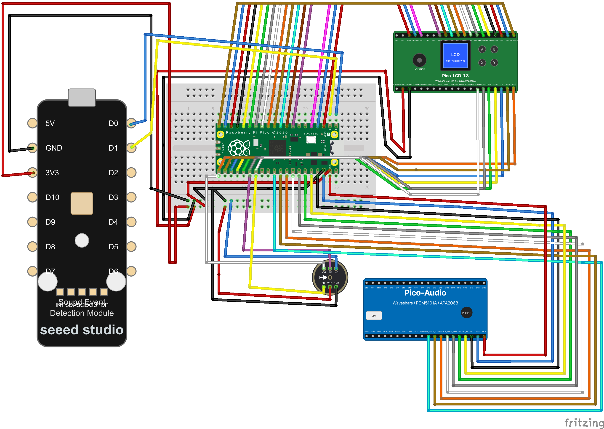
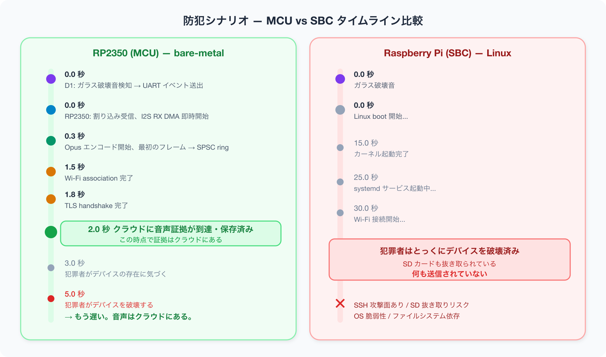
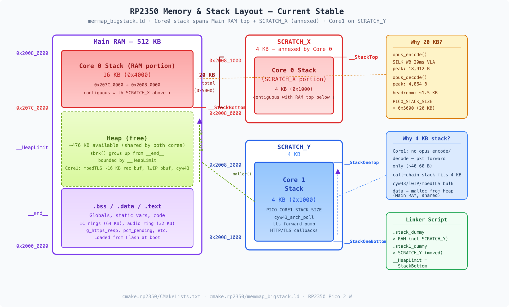

# RP2350 + Sound Event Detection Module D1 — 音をトリガーにした Smart Home Automation エッジノード

> 超低消費電力 AI 音センサ。異常音を検知した瞬間だけ起動・送信する、クラウド接続型セキュリティ端末の構想。USB-C 給電でもバッテリー駆動でも動く。

---

## はじめに — MCU で「音に反応する端末」を作るジレンマ

RP2350 (Pico 2 W) は $7 クラスの MCU でありながら、PIO I2S・DMA・dual-core 分離・Opus 圧縮を組み合わせれば、Wi-Fi + TLS 常時接続のリアルタイム音声端末を構成できる。I2S MEMS マイク (INMP441) で音声をキャプチャし、Opus 16 kbps にエンコードしてクラウドへ送信する — PCM 直送比 93.75% の帯域削減。

しかし「特定の音が鳴ったときだけ送信したい」場合、MCU 単体では手詰まりになる。

| 選択肢 | 問題 |
|---|---|
| **常時クラウド送信** | 帯域・電力が膨大。バッテリー駆動不可 |
| **エッジで VAD / 音分類** | SBC (Raspberry Pi 等) レベルの計算資源が必要。MCU では動かない。SBC では消費電力が高すぎる |

MCU の低消費電力は魅力だが音の分類ができない。SBC なら分類できるが電力を食う。**低消費電力とエッジ音分類は両立しない** — これがジレンマ。

**Seeed Studio Sound Event Detection Module D1** は、このジレンマを解消する。内蔵マイク + オンチップ AI で音分類をエッジ完結させ、結果を UART で出力する。消費電力は mW オーダー。MCU に 1 本のシリアル線で追加するだけで、**MCU レベルの消費電力のまま、エッジ音分類が手に入る**。

名前を付けるなら **Audio Sentinel** — 超低消費電力・小型クラウド音イベントセキュリティ端末。

---

## なぜ D1 との相性が良いのか

RP2350 の音声パイプラインが、そのまま D1 のバックエンドになる。

| RP2350 側の構成要素 | D1 追加後の役割 |
|---|---|
| INMP441 → I2S RX → Opus encode | 検知後の音声キャプチャ・圧縮パイプライン |
| Opus 16 kbps (PCM 比 93.75% 削減) | 検知時だけ送れば帯域・電力がさらに激減 |
| TLS 常時接続 (CYW43 Wi-Fi) | 検知イベント + 音声の即時クラウド送信 |
| Cloud relay (GPU/CDN 不要の最小構成) | 通知・証跡保存のバックエンド |
| BLE プロビジョニング | Wi-Fi 設定はスマホから |
| LCD + ボタン UI | 検知状態の表示・感度調整 |

**追加ハードウェアはモジュール 1 個とシリアル線 2 本だけ。**

---

## Sound Event Detection Module D1 とは

Seeed Studio が提供するオンチップ AI 音イベント検知モジュール。内蔵マイクと推論エンジンで環境音をリアルタイム分類し、検知結果を UART シリアルで出力する。

<div style="text-align:center; width:80%; box-sizing:border-box;">
    
</div>

### 検知可能なイベント例

| カテゴリ | 検知音 |
|---|---|
| **防犯** | ガラス破壊音、銃声、ドア破壊音 |
| **火災・防災** | 火災報知器 (T3/T4)、煙探知機アラーム |
| **見守り** | 赤ちゃんの泣き声、叫び声、転倒音 |
| **生活音** | いびき、咳、電子レンジ終了音 |
| **ペット** | 犬の吠え声、猫の鳴き声 |

**重要な特性:**

- **エッジ推論** — クラウドに音声を送らずにモジュール単体で分類が完結する
- **超低消費電力** — 常時リスニングしていても mW オーダー
- **シリアル出力** — UART で検知イベント名 + 信頼度を出力するだけ。RP2350 の GPIO 2 本で接続可能

---

## システム構成

<div style="text-align:center; width:80%; box-sizing:border-box;">
    
</div>

### 動作フロー

<div style="text-align:center; width:80%; box-sizing:border-box;">
    
</div>

**D1 が「いつ」を決め、RP2350 が「何を」送るかを決める。** 役割が完全に分離される。

---

## 配線図

<div style="text-align:center; width:80%; box-sizing:border-box;">
    
</div>

D1 モジュールとの接続は 5V / GND / UART TX / UART RX の 4 線のみ。

---

## なぜこの構成が合理的か

### 1. 帯域削減の二段構え

| 段階 | 手法 | 効果 |
|---|---|---|
| **第 1 段: D1 (時間軸の削減)** | 検知時だけ送信 | 送信時間を 24h → 数秒/回に削減 |
| **第 2 段: Opus (空間軸の削減)** | PCM → Opus 16 kbps | ビットレート 93.75% 削減 |

常時送信 PCM: **256 kbps × 24h = 2.7 GB/日**
D1 + Opus (1 日 10 回 × 5 秒): **16 kbps × 50 秒 = 100 KB/日**

**帯域 27,000 分の 1。** Wi-Fi の消費電力も比例して下がる。

### 2. プライバシー・バイ・デザイン

- D1 のエッジ AI が音の「種別」だけを判定 — 会話内容はクラウドに送られない
- 音声送信は検知後の数秒だけ — 常時送信ではない
- クラウドは relay + storage のみ — GPU 推論も音声認識もしない

### 3. MCU だからできる瞬間起動 — 壊されても、もう遅い

これは SBC (Raspberry Pi / Jetson) では **絶対にできない**。

| | RP2350 (MCU) | Raspberry Pi (SBC) |
|---|---|---|
| **cold boot → 送信開始** | **~2 秒** | 30–60 秒 |
| **内訳** | PIO I2S 起動 < 1 ms, Wi-Fi associate ~1.5 s, TLS handshake ~0.3 s | Linux kernel boot 15 s, systemd services 10 s, Wi-Fi dhclient 5 s, Python runtime 3 s, TLS 1 s |
| **OS** | なし (bare-metal) | Linux (カーネル + init + デーモン群) |
| **ファイルシステム** | なし (Flash XIP) | SD カード mount + fsck |
| **脆弱面** | なし | SSH, OS 脆弱性, SD 抜き取り |

**防犯シナリオで何が起きるか:**

<div style="text-align:center; width:80%; box-sizing:border-box;">
    
</div>

**MCU の bare-metal 起動は「セキュリティ機能」である。** OS がないことは制約ではなく、防犯デバイスにとっては利点になる。ブートローダーもファイルシステムも init プロセスもない — 電源が入った瞬間にコードが走る。攻撃面もゼロ: SSH ポートもシェルも存在しない。

さらに、D1 自体は常時給電・常時リスニングしているため、RP2350 を deep sleep にしておき D1 の検知で GPIO 割り込み起床させる構成も可能。この場合、**待機電力は D1 の数 mA のみ** — バッテリー駆動が視野に入る。

**バッテリー構成例: Eneloop 2 本 + スーパーキャパシタ**

| 状態 | 消費電流 (3.3V 側) | 時間比率 |
|---|---|---|
| 待機 (D1 リスニング + RP2350 dormant + CYW43 電源断) | ~1.5–2 mA | 99.9% |
| イベント発火 (RP2350 起床 + CYW43 Wi-Fi TX) | ~300 mA peak | 数秒/回 |

CYW43 の Wi-Fi TX ピークは ~300 mA に達するが、発火は 1 日数回・数秒ずつ。スーパーキャパシタ (1–数 F) でピークをバッファし、バッテリーからの定常給電は ~2 mA に抑える。

```
Eneloop 2 本 (2.4V, 1900 mAh)
    → boost converter (→ 3.3V, 効率 ~85%)
    → スーパーキャパシタ (Wi-Fi TX ピークバッファ)
    → D1 (常時給電 ~1 mA) + RP2350 (dormant ~0.2 mA / burst)
```

バッテリー側 ~2.5 mA → **Eneloop 2 本で約 1 ヶ月**。USB-C 給電が取れない場所 — 屋外の物置、離れ、車内 — にも設置できる。

### 4. 双方向 — スマホから現場に声を届ける

RP2350 は PIO I2S TX + PCM5101A DAC + スピーカーによる下り音声再生を備えている。つまり、検知 → 通知の片方向ではなく、**スマホから現場に向かって話しかける双方向インターコム** が成立する。

```
D1 検知 → Opus 上り → Cloud → スマホ通知
                                    ↓ ユーザーが「何があった？」と発話
                              スマホ → Cloud → Opus 下り → RP2350 → スピーカー再生
```

スマホ側は通知を受けた時点で即座にトークバックできる。現場側は追加ハードウェア不要 — I2S DAC と DMA ring 32 KB の下り再生パイプラインが構成に含まれている。

**ユースケース:**

| シーン | スマホからの応答 |
|---|---|
| 高齢者見守り — 転倒音検知 | 「大丈夫ですか？」と声をかける |
| 防犯 — ガラス破壊音検知 | 「通報しました」と威嚇する |
| ペット見守り — 犬が吠え続ける | 飼い主の声で落ち着かせる |
| 玄関 — ドア開閉検知 | 「おかえり」と自動再生 |

### 5. クラウドコストほぼゼロ

クラウド側は GPU も CDN も持たない relay 中心の最小構成で設計する。D1 + RP2350 はイベント駆動で数秒の Opus パケットを送るだけなので、クラウド側の負荷はほぼゼロ。スマホからのトークバックも Opus 下りパケットを relay するだけ — 追加のサーバーリソースは不要。

---

## Smart Home Automation ユースケース

| カテゴリ | D1 検知 | RP2350 アクション | Cloud → ユーザー |
|---|---|---|---|
| **玄関監視** | ガラス破壊音 | Opus で検知後 5 秒送信 | 「玄関で異常音を検知」+ 音声再生 |
| | ドア開閉音 | イベントログ送信 | 帰宅通知 |
| | 金属打撃音 | Opus + 高優先度フラグ | 即座にスマホ通知 |
| | | | |
| **高齢者見守り** | 助けを呼ぶ声 | Opus で検知後 10 秒送信 | 緊急通知 + 音声確認 |
| | 転倒音 | イベント + 音声送信 | 「転倒の可能性があります」 |
| | 長時間無音 | 無音タイムアウト通知 | 「2 時間音が検知されていません」 |
| | | | |
| **防犯** | 窓破壊音 | Opus 送信 + アラート | 即座にスマホ通知 |
| | 不審な足音 | イベントログ | タイムライン記録 |
| | 銃声 | 最高優先度送信 | 緊急通報連携 |
| | | | |
| **ペット見守り** | 犬の吠え声 (連続) | Opus で録音・送信 | 「犬が 5 分以上吠えています」 |
| | 猫の鳴き声 (異常) | イベント + 音声 | 体調異常の可能性通知 |
| | | | |
| **家電連携** | 電子レンジ終了音 | イベント通知 | スマホ通知「レンジ完了」 |
| | 洗濯機終了音 | イベント通知 | 「洗濯が終わりました」 |
| | 火災報知器 (T3/T4) | 高優先度通知 + Opus | 全照明点灯 + 緊急通知 |

---

## Dual-Core アーキテクチャへの D1 統合

RP2350 の 2 コアを完全に分離した音声パイプラインに、D1 がどう組み込まれるか。

| | Core 0 (20 KB stack) | Core 1 (4 KB stack) |
|---|---|---|
| **役割** | Audio / UI / Opus Encode & Decode | Network / Transport / Forwarding |
| **Stack 配置** | Main RAM top + SCRATCH_X (併合) | SCRATCH_Y |
| **重い処理** | opus_encode (SILK VLA peak 18.9 KB) | TLS handshake / cyw43_arch_poll |
| **Loop cadence** | 1 ms | 500 μs |

Core 間通信は **64 KB の SPSC ring buffer + HW FIFO notify (8 slot)**。バックプレッシャーは audio ring 充填率 75% → IC dequeue 停止 → IC ring 充填 → ic_send_avail==0 → forward_pump skip → g_https_resp 充填 → recv_cb ERR_MEM → TCP window close まで自動カスケードする。

### 音声パイプライン — 上り/下り非対称設計

上りと下りは **独立した DMA ring を持ち、サイズ・方向・バッファリング戦略が非対称** である。

<div style="text-align:center; width:80%; box-sizing:border-box;">
    
</div>

下りはトークバック音声のリアルタイム連続再生のため大きな DMA ring (32 KB) で揺らぎを吸収し、上りはイベント検知時のバッチ送信のため ring は最小限 (4 KB) にして encoder + accumulator 側でバッファリングする。用途が違うので対称にする理由がない。

### SRAM 配分 — 520 KB のゼロサムゲーム

<div style="text-align:center; width:80%; box-sizing:border-box;">
    
</div>

RP2350 は Main RAM (512 KB) とは別に SCRATCH_X / SCRATCH_Y (4 KB × 2) を持つ。Opus encoder の SILK VLA は `opus_encode` 呼び出し中にスタックを **18,912 B** まで膨張させるため、SDK デフォルトの 4 KB では到底足りない。

カスタムリンカスクリプト `memmap_bigstack.ld` で Core 0 のスタックを Main RAM top に移設し、物理的に隣接する SCRATCH_X を併合して **20 KB** を確保 — **ヒープを一切削らずに** Opus encode のピークを収容する。Core 1 は SCRATCH_Y (4 KB) に退避。520 KB MCU ではスタック・ヒープ・BSS がゼロサムゲームであり、canary-paint + sbrk(0) + opus_get_size の 3 点同時計測でこのレイアウトに収束した。

### Core 0 への D1 統合

```
INMP441 → I2S RX DMA → Opus encode → SPSC ring → Core 1 (TLS 送信)
D1 UART RX → イベントパース → 録音トリガー制御 (上記パイプラインの起動/停止)
```

Core 0 は Audio / UI を担当し、UART の受信パースは軽量（数バイトのイベントラベル）なので負荷増はほぼない。D1 からイベントを受信したら:

1. INMP441 の I2S RX DMA を有効化（またはリングバッファの読み出しを開始）
2. 検知後数秒分の Opus エンコードを実行
3. イベントメタデータ（種別 + 信頼度 + タイムスタンプ）をペイロードに付与
4. SPSC ring 経由で Core 1 へ転送

### Core 1 の変更なし

Core 1 は Network / Transport 専任。SPSC ring からデータを取り出して TLS 送信する — この動作は常時送信でもイベント駆動でも同じ。**Core 1 のコードは常時送信でもイベント駆動でも同じ。** トークバックの下り（Cloud → Opus decode → DAC）も同一の下りパイプラインで処理する。

### D1 追加によるメモリへの影響

| 追加要素 | コスト |
|---|---|
| UART RX バッファ | ~256 B (BSS) |
| イベントパーサ | ~1 KB (Flash) |

520 KB の SRAM 予算に対して **~1.3 KB の追加** — ヒープ余力で十分吸収できる。Opus encoder/decoder・DMA ring・SPSC ring・TLS バッファはすべて上述の SRAM 配分内。

---

## まとめ

構成要素はすべて揃っている:

- **検知** — D1 のエッジ AI (mW オーダー)
- **上り** — INMP441 → Opus encode → Cloud (93.75% 帯域削減)
- **下り** — Cloud → Opus decode → PCM5101A DAC → スピーカー (トークバック)
- **送信** — TLS 常時接続 (CYW43)
- **クラウド** — relay のみ (GPU/CDN 不要)
- **通知** — スマホプッシュ通知
- **設定** — BLE ゼロタッチプロビジョニング

---

## Technical Stack (D1 追加後)

| Layer | What | Why |
|---|---|---|
| MCU | RP2350 dual-core 200 MHz | $7 クラス、Opus リアルタイムエンコード可能 |
| Sound Event Detection | Seeed Studio D1 Module | エッジ AI 音分類、UART 出力 |
| Wi-Fi | CYW43 (Pico 2 W) | 常時 TLS 接続 |
| TLS | mbedTLS | HTTPS / WSS |
| Codec (encode) | Opus (SILK fixed-point) 16 kHz mono 16 kbps | MCU → Cloud イベント検知時の音声圧縮送信 |
| Codec (decode) | Opus (SILK fixed-point) 24 kHz mono | Cloud → MCU トークバック再生 |
| Audio In | PIO I2S RX ← INMP441 MEMS mic | 検知トリガー後の音声キャプチャ |
| Audio Out | PIO I2S TX → PCM5101A DAC + スピーカー | DMA ring 32 KB、スマホからのトークバック再生 |
| IC Bus | SPSC ring + HW FIFO | lock-free, zero-copy |
| Provisioning | BLE (BTstack) | iOS app でゼロタッチ設定 |
| Display | ST7789 1.3" LCD (optional) | 検知状態表示 |
| Power | USB-C 5V / Eneloop 2 本 + boost + supercap | コンセント or バッテリー駆動 |
